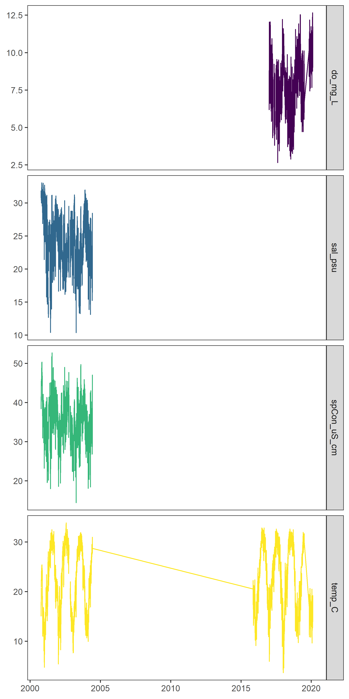

#TERREBONNE BAY TRAWL ANALYSIS SUMMARY {.unlisted .unnumbered}

*insert terrebonne image here*

This document summarizes trawl catch data within Terrebonne Bay, Louisiana (*lat. long.*) conducted by the Education Department of the Louisiana Universities Marine Consortium (LUMCON) from 2007 - 2020.

# Metadata summary

## Sampling locations map
*insert sampling locations, i.e. trawls start and stop, here*

# Environmental Data

A suite of environmental data have been collected through <a href="https://lumcon.edu/environmental-monitoring/" target="_blank">LUMCON's environmental monitoring program</a> over the course of the study period. These variables include:

- Water Temperature
- Salinity
- Specific conductivity
- Dissolved Oxygen

These data vary in coverage and are being updated:

There are a number of reasons for data holes and more complete data will be necessary for any final analyses, but this shows the emerging environmental picture.

# Biological Data

The education department has been conducting trawl surveys pretty consistently since 2007.

## Sampling Events

<!-- -->

There are a lot of sampling trawls over the past decade (n = 359) and they are spread over the year, with some periods of heavy sampling: 

<!-- -->

## Species sampling

Over the full dataset we can estimate the species accumulation by # of trawls from the `specaccum()` function in the <a href = "https://cran.r-project.org/web/packages/vegan/index.html" target = "_blank">vegan package</a>

<!-- -->

The trawls within each year give some insight into the differences species-effort through time (assuming each trawl is the same). This suggests there are certain years (or trawl locations) that have higher richness:

<!-- -->

Squinting this suggests that, generally, there might be increasing # of species based on the species-effort curves. The 'brighter' colors appear to be higher. I think we still need to dig in further to see if this is due to changing taxonomic resolution across the sampling period or an actual biological signal.

## Species diversity

We can start to break this down further, and the inference that species richness might be increasing over time has some support (again, not sure yet if this is real or methodological). 2020 is an obvious outlier here because we have only conducted 3 trawls (bummer) and I don't know what that little blip is in 2014. One weird instance where the code is mischaracterizing something. 

<!-- -->
 
The bottom panel can use a bit more explanation. This panel shows jaccard distance of each individual trawl from the initial trawl based on presence/absence data. Understanding the highlights and limitations of the analysis can give us a better picture of what is going on. First, a community in flux responding to directional change, we would expect the distance to increase over time. There is maybe slight evidence of this, but a lot of noise around that signal. Further, the relative effects of species turnover is quite variable over time and seems to show a larger seasonal signal relative to any trend over the time series.

## Community changes

Taking this further, we can look at how evenly species are distributed within the community. Rank-abundance plots of the community for integrated across each year show common species are always common (not surprising) and there is a lot of inter-annual variability in the less common species. Here, 'Species rank' is calculated based on the full time series and fixed. We then plot the relative abundance of each species in each year. The black line shows the global community rank-abundance relationship.

<!-- -->

These inter-annual trends aside, we see that evenness of the community doesn't show drastic differences among years. Sampling effort is going to explain some of this, but this also might represent some neutral (zero sum) or compensatory dynamics among species in the community.

<!-- -->

We can characterize the how communities shift and the important players (i.e. those with loadings on PC1 or PC2 of the most extreme 1%). This shows there is are noticeable shifts in the community composition over the years and there appears to by directional changes with time. 

<!-- -->

The environmental data will need to be completed further to begin to test if these changes are driven by the environment. In its absence, it might be a useful exercise to see how the composition of community traits might guide the expected patterns observed in the environment.

Common Name                             Mean Rank   Rank SD
-------------------------------------  ----------  --------
White Shrimp/Brown Shrimp                    1.31      0.48
Atlantic Croaker                             2.00      0.82
Anchovy                                      3.69      0.85
Spot                                         4.33      2.15
Eastern Oyster                               6.00        NA
Atlantic Brief Squid                         6.46      2.76
Hardhead Catfish/Gafftopsail Catfish         7.46      3.07
Gulf Menhaden                                7.85      4.06
Blue Crab                                    9.15      2.27
Least Pufferfish                            11.08      3.43
Sand Seatrout                               11.77      4.40
Crab spp.                                   12.00        NA
Comb Jelly                                  12.67      7.37
Atlantic Bumper                             13.17      7.09
American Butterfish                         13.25      6.88
Gizzard Shad                                13.50      0.71
Mullet                                      14.00        NA
Sea Robin                                   14.77      5.36
Hermit Crab                                 17.00      7.07
Cutlassfish                                 17.85      6.64
Bay Whiff                                   17.92      4.19
Shortfin Squid                              18.00        NA
Seatrout                                    18.29     12.30
Blackcheek Tonguefish                       18.46      4.93
Spotted Seatrout                            19.67      6.62
Gooseberry Comb Jelly                       20.00        NA
Moon Snail/Oyster Drill Snail               20.00        NA
Oyster Drill Snail                          20.10      6.28
Banded Drum                                 20.12      5.11
Crustacean indet.                           20.50      0.71
Fringed Flounder                            20.67      6.03
Lookdown                                    20.75      9.21
Atlantic Tarpon/Silver Kingfish             21.00        NA
Sardines                                    21.00        NA
Harvestfish                                 21.42      9.64
Crab                                        21.50     12.02
Star Drum                                   22.09      6.09
Pinfish                                     22.22      9.59
Flounder                                    22.43      6.13
Jellyfish                                   22.50      4.95
Atlantic Spadefish                          22.58      4.62
Thinstriped Hermit Crab                     22.83      2.32
Gulf Toadfish                               23.00      2.83
Hatchetfish                                 23.00        NA
Southern Hake                               23.36      9.64
Crevalle Jack                               23.50      6.16
Moon Snail                                  24.00      5.15
Sergeant Major                              24.00        NA
Southern Flounder                           24.10      5.24
Atlantic Moonfish                           24.29      5.77
Threadfin Shad                              24.43      8.22
Skate                                       24.50      2.65
Southern Kingfish                           24.86      2.34
Blennies                                    25.00      2.83
Silver Seatrout                             25.00     15.56
Atlantic Midshipman                         25.18      5.04
Lightning Whelk                             25.43      7.18
Atlantic Moon Jelly                         25.50      9.15
Gulf Kingfish                               25.50      4.95
Lined Seahorse                              25.50      6.36
Atlantic Needlefish                         26.00        NA
Burfish                                     26.00        NA
Cownose Ray                                 26.00        NA
Mackerel                                    26.20      6.26
Kingfish                                    26.25      7.63
Mantis Shrimp                               26.25      8.55
Hogchoker                                   26.45      5.96
Atlantic Stingray                           27.00      5.41
Brittle Star                                27.00      0.00
Sand Crab                                   27.00        NA
Scaled Sardine                              27.00     10.54
Sea Walnut                                  27.00        NA
Goby                                        27.67      5.72
Spanish Mackerel                            27.67      7.62
Black Drum                                  27.75      7.65
Tiger Shrimp                                28.00        NA
Isopod                                      28.20      6.50
Drum                                        28.33     12.90
American Silver Perch                       28.50     10.54
Ladyfish                                    28.50      4.95
Sheepshead                                  28.50      9.95
Stone Crab                                  28.50      3.54
Inshore Lizardfish                          28.78      5.54
Bluntnose Jack                              29.00      3.61
Bullhead Minnow                             29.00     14.14
Dragon Goby                                 29.00        NA
Inland Silverside                           29.00     11.43
Naked Goby                                  29.00        NA
Sargassum Swimming Crab                     29.00        NA
Sargassumfish                               29.00        NA
Florida Stone Crab                          29.50      4.51
Shad                                        29.50      6.03
Florida Pompano                             29.83      9.02
Atlantic Silverside                         30.00        NA
Herring Spp.                                30.00        NA
Southern flounder                           30.00        NA
Atlantic Seabob                             30.50      2.12
Highfin Goby                                30.50      3.83
Blacktip Shark                              31.00      5.77
Mud Brittle Star                            31.00      1.41
Pipefish                                    31.00        NA
Bluefish                                    31.80      4.32
Mangrove Snapper                            31.83      8.95
Cobia                                       32.00        NA
Filefish                                    32.00        NA
Iridescent Swimming Crab                    32.00        NA
Shrimp Eel                                  32.00        NA
Southern Stingray                           32.00      7.07
Speckled Swimming Crab                      32.00        NA
Spider Crab                                 33.00      8.00
Atlantic Thread Herring                     34.00      9.90
Lined Sole                                  34.00     12.73
King Mackerel                               35.00        NA
Mojarra Spp.                                35.00        NA
Red Drum                                    35.00      7.75
Polychaetes                                 35.25      5.12
Purse Crab                                  35.67      6.81
Skipjack Herring                            36.50     10.61
Northern Kingfish                           37.00        NA
Marsh Grass Shrimp                          38.00        NA
Mitten Crab                                 38.00        NA
Stingray                                    38.00        NA
Chain Pipefish                              42.00        NA
Gulf Hake                                   42.00        NA
Porcelain Crab                              42.00        NA
Quahog Clam                                 44.00        NA
Reticulated Brittle Star                    44.00        NA
Skilletfish                                 44.00        NA
Smooth Mud Crab                             44.00        NA
Spinycheek Sleeper                          44.00        NA
