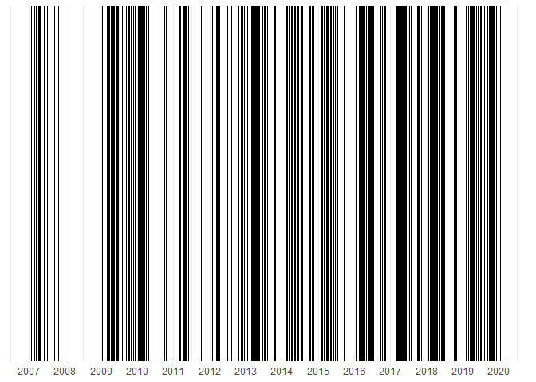

#TERREBONNE BAY TRAWL ANALYSIS SUMMARY {.unlisted .unnumbered}

*insert terrebonne image here*

This document summarizes trawl catch data within Terrebonne Bay, Louisiana (*lat. long.*) conducted by the Education Department of the Louisiana Universities Marine Consortium (LUMCON) from 2007 - 2020.

# Metadata summary

## Sampling locations map
*insert sampling locations, i.e. trawls start and stop, here*

# Environmental Data

A suite of environmental data have been collected through <a href="https://lumcon.edu/environmental-monitoring/" target="_blank">LUMCON's environmental monitoring program</a> over the course of the study period. These variables include:

- Water Temperature
- Salinity
- Specific conductivity
- Dissolved Oxygen

These data sets range in coverage, and are being added to continuously:

More data will be necessary to fully complete analyses, but this shows the emerging environmental picture.

# Biological Data

The education department has been conducting trawl surveys pretty consistently since 2007. These sampling dates are pretty evenly distributed throughout the year

## Sampling Events

<!-- -->

